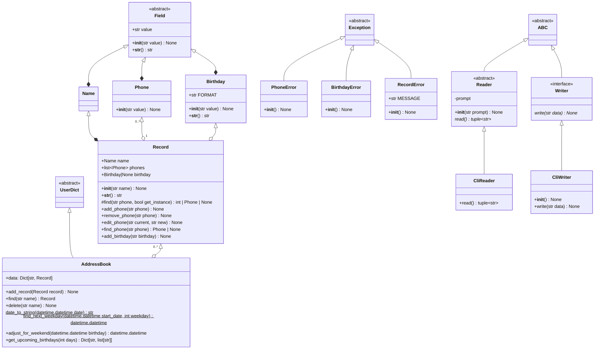

```mermaid
classDiagram
    Field <|--* Name
    Field <|--* Phone
    Field <|--* Birthday

    Name <|--* Record
    Phone "0..*" <|--o "1" Record
    Birthday <|--o Record

    UserDict <|-- AddressBook
    Record "0..*" <|--o "1" AddressBook

    Exception <|-- PhoneError
    Exception <|-- BirthdayError
    Exception <|-- RecordError

    ABC <|-- Reader
    Reader <|-- CliReader

    ABC <|-- Writer
    Writer <|-- CliWriter

    class Field {
        <<abstract>>
        +str value
        +__init__(str value) None
        +__str__() str
    }

    Phone: +__init__(str value) None

    class Birthday {
        +str FORMAT
        +__init__(str value) None
        +__str__() str
    }

    class Record {
        +Name name
        +list~Phone~ phones
        +Birthday|None birthday
        +__init__(str name) None
        +__str__() str
        #find(str phone, bool get_instance) int | Phone | None
        +add_phone(str phone) None
        +remove_phone(str phone) None
        +edit_phone(str current, str new) None
        +find_phone(str phone) Phone | None
        +add_birthday(str birthday) None
    }

    class UserDict {
        <<abstract>>
    }

    class AddressBook {
        +data: Dict[str, Record]
        +add_record(Record record) None
        +find(str name) Record
        +delete(str name) None
        date_to_string(datetime.datetime date) str$
        find_next_weekday(datetime.datetime start_date, int weekday) datetime.datetime$
        +adjust_for_weekend(datetime.datetime birthday) datetime.datetime
        +get_upcoming_birthdays(int days) Dict[str, list[str]]
    }

    class Exception {
        <<abstract>>
    }

    PhoneError: +__init__() None
    BirthdayError: +__init__() None

    class RecordError {
        +str MESSAGE
        +__init__() None
    }

    class ABC {
        <<abstract>>
    }

    class Reader {
        <<abstract>>
        -prompt
        +__init__(str prompt) None
        read() tuple~str~*
    }

    CliReader: +read() tuple~str~

    class Writer {
        <<interface>>
        write(str data) None*
    }

    class CliWriter {
        +__init__() None
        +write(str data) None
    }
```
